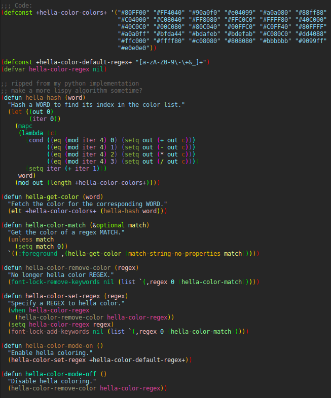

# hella-color-mode
Add some color to your boring code

## Screenshot


## Usage
```
(hella-color-mode)
(hella-color-set-regex "[a-zA-Z_][a-zA-Z0-9_]*")
```
Modify hella-color-set-regex for whatever you want to be colored
To modify the colors just edit the file manually. I'll fix that later maybe.